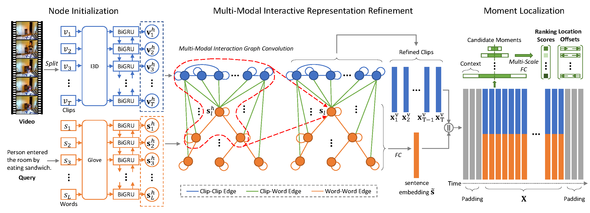

# Multi-modal Interaction Graph Convolutioal Network for Temporal Language Localization in Videos

Official implementation for *[Multi-Modal Interaction Graph Convolutional Network for Temporal Language Localization in Videos](https://ieeexplore.ieee.org/document/9547801)*

## Model Pipeline


## Usage
### Environment Settings
We use the `PyTorch` framework.
* Python version: 3.7.0
* PyTorch version: 1.4.0

### Get Code
Clone the repository:
```shell
git clone https://github.com/zmzhang2000/MIGCN.git
cd MIGCN
```

### Data Preparation
#### Charades-STA
* Download the [preprocessed annotations and features](https://drive.google.com/drive/folders/1p83rJ8DHWJgxcUHFcLh-5add0gLf3FDu?usp=sharing) of Charades-STA with I3D features.
* Save them in `data/charades`.

#### ActivityNet
* Download the [preprocessed annotations](https://drive.google.com/drive/folders/1N0I7U8Guum553UTDDM75fLIPEFXx4BKX?usp=sharing) of ActivityNet.
* Download the [C3D features](http://activity-net.org/challenges/2016/download.html#c3d) of ActivityNet.
* Process the C3D feature according to `process_activitynet_c3d()` in `data/preprocess/preprocess.py`.
* Save them in `data/activitynet`.

#### Pre-trained Models
* Download the [checkpoints](https://drive.google.com/drive/folders/1OiowCRhQTI8SdpiZpwy8P02SPJIwWZkJ?usp=sharing) of Charades-STA and ActivityNet.
* Save them in `checkpoints`

#### Data Generation
We provide the generation procedure of all MIGCN data.

* The raw data is listed in `data/raw_data/download.sh`.
* The preprocess code is in `data/preprocess`.

### Training
Train MIGCN on Charades-STA with I3D feature:
```shell
python main.py --dataset charades --feature i3d
```

Train MIGCN on ActivityNet with C3D feature:
```shell
python main.py --dataset activitynet --feature c3d
```

### Testing
Test MIGCN on Charades-STA with I3D feature:
```shell
python main.py --dataset charades --feature i3d --test --model_load_path checkpoints/$MODEL_CHECKPOINT
```

Test MIGCN on ActivityNet with C3D feature:
```shell
python main.py --dataset activitynet --feature c3d --test --model_load_path checkpoints/$MODEL_CHECKPOINT
```

### Other Hyper-parameters
List other hyper-parameters by:
```
python main.py -h
```

## Reference
Please cite the following paper if MIGCN is helpful for your research
```
@ARTICLE{9547801,
  author={Zhang, Zongmeng and Han, Xianjing and Song, Xuemeng and Yan, Yan and Nie, Liqiang},
  journal={IEEE Transactions on Image Processing}, 
  title={Multi-Modal Interaction Graph Convolutional Network for Temporal Language Localization in Videos}, 
  year={2021},
  volume={30},
  number={},
  pages={8265-8277},
  doi={10.1109/TIP.2021.3113791}}
```